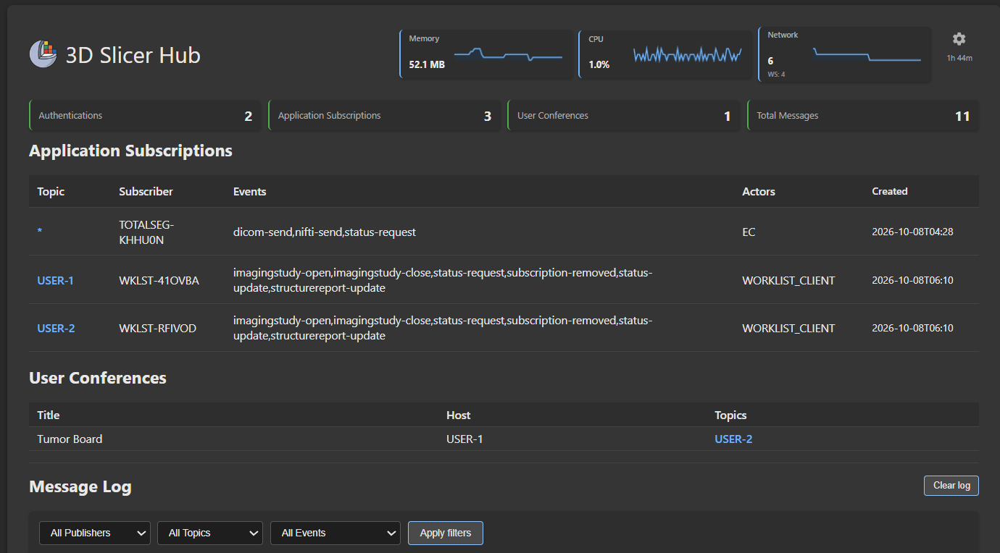
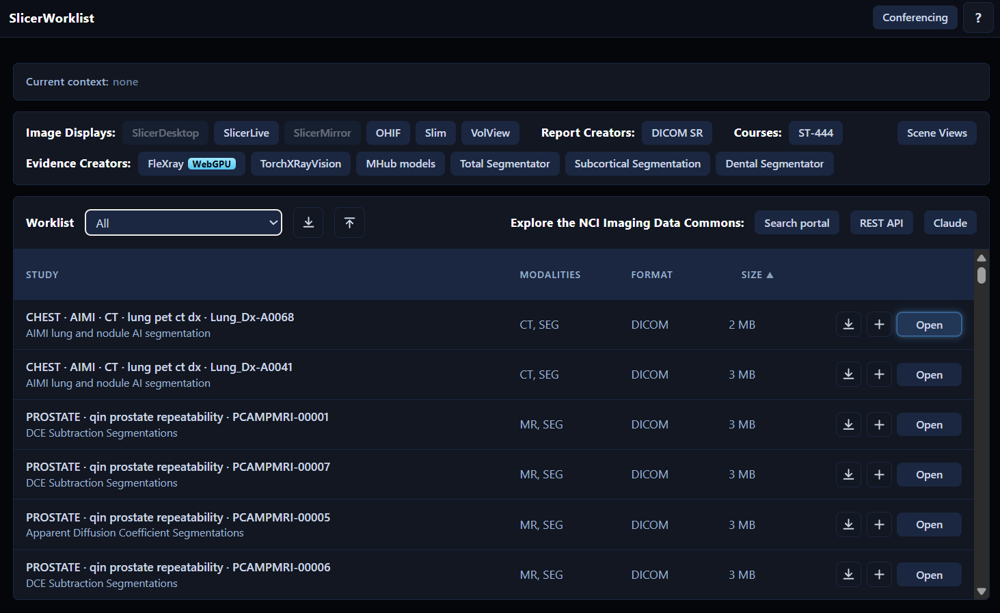
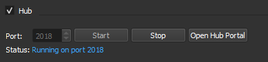
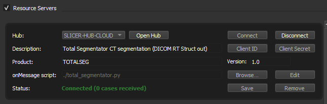
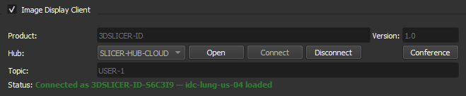
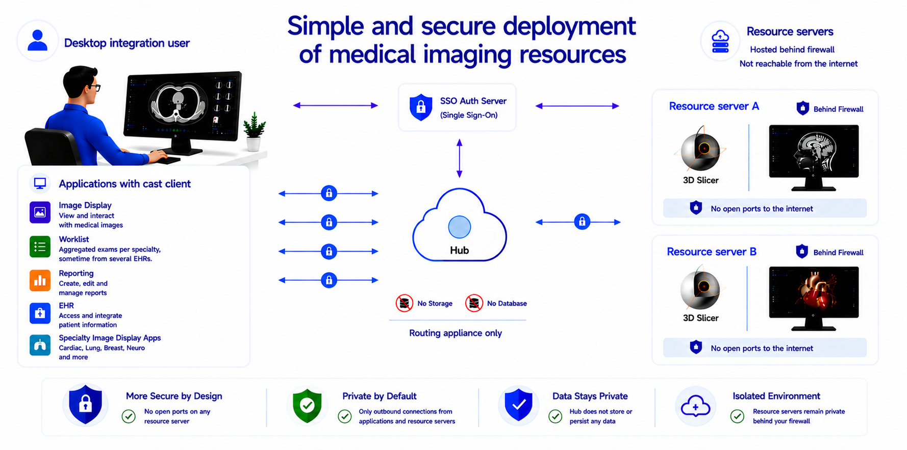

# Slicer Hub Extension

<p align="center">
  
</p>

The Slicer Hub extension is  an open-source, MIT licensed, [WebSub-based](https://en.wikipedia.org/wiki/Publish%E2%80%93subscribe_pattern)  desktop integration messaging infrastructure that connects users of image displays, worklists, reporting tools, conferencing tools, remote inference models and AI Orchestrators.

Try the [online example worklist client](https://slicerhub-azejffgnb7dve8es.canadaeast-01.azurewebsites.net/worklist-client/) or watch the [classroom vanishing brush tool](https://youtu.be/xKQEOs1_9Bg) along with this documentation to find out more.

## Overview

Slicer Hub aims to  promote, train, develop, and demonstrate interoperability in medical imaging applications. Its original intent was to support the [IHE Integrated Reporting Application](https://profiles.ihe.net/RAD/IRA/) workflow; currently [IHE AI Results](https://wiki.ihe.net/index.php/AI_Results) is more in focus.
 
This python extension supplies the **HUB**, service provider example scrips, and the Slicer Qt **Image Display** client. Together with its sister repository of [javascript clients](https://github.com/mbellehumeur/SlicerHub-js-clients), the system includes:

- a WebSub hub (**HUB** actor) for communication between applications and users
- a worklist application (**WORKLIST_CLIENT** actor) 
- open-source medical imaging viewers (**IMAGE_DISPLAY** actors)
- open-source medical imaging inference models (**EVIDENCE_CREATOR** actors)
- a DICOM SR reporting example (**REPORT_CREATOR** actor - WIP)
- the [Imaging Data Commons](https://imaging.datacommons.cancer.gov/) and the [3D Slicer](https://www.slicer.org/) DICOM DB as read-only image archives (**IMAGE_ARCHIVE** actor)
- an authentication / identity provider with integration to the hub OIDC endpoints or built-in hub anonymous/mock authentication

The extension also includes features for education that are independent of the IHE Integrated Reporting workflow:

- creating, saving, and uploading teaching files and cohorts for class preparation
- conferencing for collaborative viewing and teaching
- a [vanishing brush tool](https://youtu.be/xKQEOs1_9Bg?si=-gtvlB3aeq3KF-dX) for temporary annotations during conferencing
- export to STL for 3D printing

Research and 3D Slicer functionalities, also independent of IHE, are included:

- File transfer between applications 
- Medical Reality scenes communication with the long term goal of inference of multi-application hanging protocols (SceneViews).
- Status-request messaging for using current information from other applications in the workflow
- Slicer Qt Image Display client and DICOM DB study list (same python/websocket client)

File transfer allows inference servers to send their results directly back to the viewers without having to archived them to PACS first. It also supports research file formats like NIfTI, NRRD, and Zarr.   Transfer is realized with multi-part POST to the hub and then GET retrieves from the receiving applications and service providers.  The file naming policy is decribed [here](docs/module/filename-policy.md). 


The extension javascript client libraries can be used to participate in IHE reporting workflows but it  does not include a FHIR server or a FHIR Diagnostic Report Creator. 

For open-source FHIRcast with a FHIR viewer (SMART launch and hub subscription), see the [OHIF FHIR Viewer](https://ohif.org/modes/fhir-viewer/) mode or [Medplum](https://www.medplum.com/docs/fhircast).

 For an overview of common features and differences of the Slicer Hub vs FHIRcast see [docs/module/hub-description.md](docs/module/hub-description.md).

## Background

Slicer Hub is an offshoot of [FHIRcast](https://fhircast.hl7.org/). FHIRcast is the standard replacing Epic’s file drop interface for integration with PACS and reporting systems. It provides a secure event messaging infrastructure using a hub with websocket subscriptions.

<p align="center">
  
</p>


You can test websocket subscription integration with the Slicer Hub worklsit example. Open a study in the worklist here:

[Open worklist demo](https://slicerhub-azejffgnb7dve8es.canadaeast-01.azurewebsites.net/worklist-client/)

<p align="center">
  <a href="https://slicerhub-azejffgnb7dve8es.canadaeast-01.azurewebsites.net/worklist-client/">
    
  </a>
</p>

And then open the DICOM SR and test interoperability with the visualtization controls.

## Extension Features

The extension features a hub and two hub interfaces: one for connecting inference models like Total Segmentator (service providers) and another to connect the 3D Slicer Qt viewer (Image Display client) and DICOM DB  to the hub.

### Hub

The hub is a stateless routing appliance that distributes messages and handles data transfer requests over the websocket and http to each client.

<p align="center">
  
</p>

It can be used without the Slicer extension by running the `hub.py` script.

### Service Providers

Service Providers are scripts that typically connect inference servers to the hub using a websocket connection. This allows users to, for example, view results without having to send them to the PACS archive first.

The service provider tab provides a visual description of how processing resources can be connected to the hub and made available to hub workflows.

<p align="center">
  
</p>

Service Providers subscribe to all user topics for status-request and dicom/nifti events. In the example, Total Segmentator sends binary results back to the user through the hub.

Since these resources do not log in as a user, they need a *service provider entry* in the customer's authorization server. This provides a client id and client secret. For the hub extension hub, they must be configured in the environment variables of the hub for the resource to connect successfully.

### Image Display Client

The image display client provides a PACS client type interface to the 3D Slicer viewer. Supported events include ImagingStudy-open, ImagingStudy-close, dicom-send, and status-request (embedded sceneview).

<p align="center">
  
</p>

### Simplified, secure deployment of medical imaging services

This architecture protects service providers by eliminating direct inbound internet exposure entirely. No hostname is required and no changes to the networking environment are needed. No VPN or proxy to configure.

Each service provider establishes only outbound encrypted connections to the hub, which functions exclusively as a routing appliance. Because no inbound ports need to be opened on hospital or enterprise networks, the service providers remain protected behind existing firewalls and are never directly reachable from the public internet.

It also simplifies providing resources in-house since the IT department only needs to add a hostname and rules for the hub. They do not have to touch their networking every time a new service provider is available for use. They only have to configure a shared service provider key for it in their authorization server.

For the hub, the architecture provides a significantly reduced attack surface and minimizes operational security risk since it maintains no storage or database.

<p align="center">
  
</p>

After installation, the service providers' outbound ports can also be locked down, allowing access to the hub and sites needed by the resource only.

In theory, the hub can be cloud deployed as a serverless application. In practice, many of those low-cost offerings do not support websocket services and a docker based offering is necessary like Azure WebApps or AWS Elastic Beanstalk.

For high availability deployment a hot standby configuration can be used. The “reset server” button in the hub admin portal allows testing workflow behavior during failover.

The hub provides a test mock auth endpoint that assigns a user when none is provided. For public web applications that do not need user authentication but want to use the service providers, the mock endpoints provide the required functionality.

Since the service providers are not on the internet, you will get shared keys for the auth server. The hub can use domain name certificates.

## Installation

### Install from the 3D Slicer Extension Manager

1. Open **3D Slicer**
2. Open the **Extension Manager**
3. Search for **Slicer Hub**
4. Click **Install**
5. Restart 3D Slicer

## Developers

| Path | Purpose |
|------|---------|
| [`HubInterface/`](HubInterface/) | Slicer module package (`HubInterface.py`, `Lib/`, `Resources/`, bundled runtime) |
| `HubInterface/hub/` | FastAPI Slicer hub (`hub.py`) |
| `HubInterface/service_providers/` | Service-provider framework + products |
| `HubInterface/image_display/` | Slicer image display runtime + CLI |
| `HubInterface/python_client/` | Python `hub_client` package |
| [`docs/`](docs/) | Extension docs (module docs under `docs/module/`) |

CMake install copies `HubInterface/` into `qt-scripted-modules/HubInterface/` (module scripts + bundled folders).

### Quick start (no Slicer Hub module)

```bash
cd HubInterface

# One-time: shared Python client
pip install -e python_client

# Terminal 1 — Hub
cd hub && pip install -r requirements.txt && python hub.py --port 2018

# Terminal 2 — Service provider (examples)
python service_providers/products/neuro_seg.py --local
# python service_providers/products/total_segmentator.py --local

# Terminal 3 — Slicer image display (Slicer required; module NOT required)
Slicer --python-script image_display/run_image_display.py -- --local --topic USER-1
```

Admin UI: http://127.0.0.1:2018/api/hub/admin

See [docs/standalone-components.md](docs/standalone-components.md) for details.

### 3D Slicer extension (dev)

Build from this repo (`CMakeLists.txt` at repo root, module in `HubInterface/`). For dev, add the **repo root** to Additional module paths — Slicer discovers `HubInterface/HubInterface.py`.

Optional sync into an installed module directory:

```bash
export SLICER_HUB_EXTENSION="/path/to/qt-scripted-modules/HubInterface"
python tools/sync_extension.py --bundle
```

Override module root at runtime with `HUB_REPO_ROOT` when needed.

## License

Slicer Hub is distributed under the [MIT License](LICENSE).

## Acknowledgements

**3D Slicer** — open-source platform for medical image computing from the [3D Slicer community](https://www.slicer.org/). This extension is built for and distributed through the 3D Slicer extension ecosystem.

**TotalSegmentator** was created by the Department of Research and Analysis at University Hospital Basel. If you use it, please cite our Radiology: Artificial Intelligence paper ([free preprint](https://arxiv.org/abs/2208.05868)). If you use it for MR images, please cite the TotalSegmentator MRI *Radiology* paper ([free preprint](https://arxiv.org/abs/2405.19492)).

**nnU-Net** — TotalSegmentator is heavily based on nnU-Net ([preprint](https://arxiv.org/abs/1809.10486)).

**IDC Claude** — builds custom worklists from natural-language queries against the [Imaging Data Commons](https://portal.imaging.datacommons.cancer.gov/) (National Cancer Institute) using Anthropic Claude. Query guidance follows the [IDC skill](https://github.com/ImagingDataCommons/imaging-data-commons-skill).

**idc-index** — official [Imaging Data Commons](https://github.com/ImagingDataCommons/idc-index) Python package for local DuckDB SQL against IDC metadata and DICOM series download URLs; used by the IDC Claude service provider. If you use it in research, cite Fedorov A, et al., *Radiographics* ([2023](https://doi.org/10.1148/rg.230180)).

**VolView** — open-source web viewer from [Kitware, Inc.](https://github.com/Kitware/VolView).

**OHIF** — open-source zero-footprint viewer from the [Open Health Imaging Foundation](https://ohif.org/).

**Slim** — interoperable slide microscopy viewer from the [Imaging Data Commons](https://github.com/ImagingDataCommons/slim) (National Cancer Institute).

## Standards and trademarks

DICOM® is the registered trademark of the National Electrical Manufacturers Association (NEMA) for its standards publications relating to digital imaging and communications in medicine. FHIR® and related HL7 marks are registered trademarks of Health Level Seven International (HL7). IHE® is a registered trademark of HIMSS. VolView® is a trademark of Kitware, Inc. OHIF® is a trademark of the Open Health Imaging Foundation. Imaging Data Commons® is a trademark of the National Cancer Institute.

The Slicer Hub (including its hub, clients, and documentation) references ideas, workflows, and vocabulary drawn from these standards—such as DICOM objects and metadata, FHIR and FHIRcast-style context and events, and IHE actor roles (for example, Image Display and Evidence Creator)—and product names such as VolView, OHIF, and Imaging Data Commons solely to describe interoperability behavior.

**Slicer Hub is not part of these standards.** It is not published by NEMA, HL7, or HIMSS, and is not an IHE Integration Profile, a FHIR implementation guide, or a DICOM conformance statement. Use of standard names and terms does not imply endorsement, certification, or official status. All other product and company names are trademarks of their respective owners.
