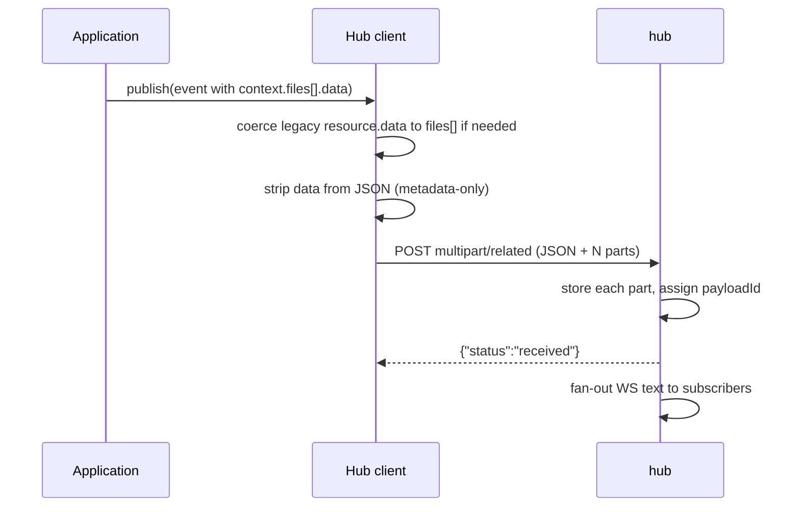
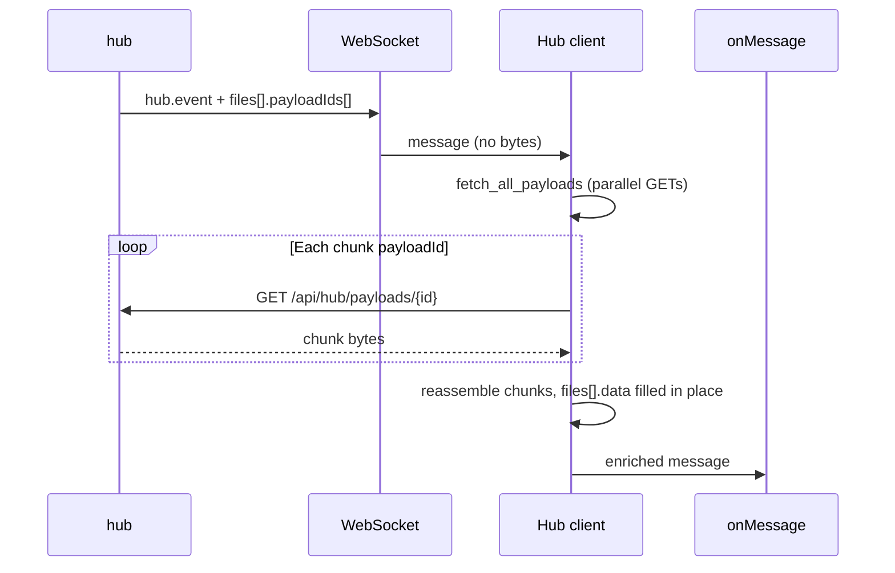

# Hub binary file transfer

Animated walkthrough (30 s loop): [images/binary-file-transfer-animated-rs-to-id.svg](images/binary-file-transfer-animated-rs-to-id.svg) (Resource Server → Image Display).
**[Interactive step-by-step version (GitHub Pages)](https://mbellehumeur.github.io/SlicerHub/binary-file-transfer.html)** — click to play each step with motion.
Inbound variant (Image Display → Resource Server): [images/binary-file-transfer-animated.svg](images/binary-file-transfer-animated.svg).
Static diagram: [images/binary-file-transfer.svg](images/binary-file-transfer.svg).

Hub carries imaging files (DICOM, NIfTI, PNG, NRRD, and similar) through a
Slicer hub without putting raw bytes on the WebSocket. The hub is a **router** with a
short-lived in-memory file store—not a PACS or long-term archive.

**Two steps for every file:**

1. **Notify** — Publisher sends metadata (and uploads bytes) over HTTP. The hub
   fans out one **text-only** WebSocket message listing `payloadIds[]` per file.
2. **Download** — Each subscriber pulls bytes when ready via
   `GET /api/hub/payloads/{payloadId}` (one GET per chunk), reassembles chunks,
   and attaches the full file to `event.context.files[]`.

Subscribers never auto-download inside the Hub client library; the application
(or Slicer `resource_server_hub.py`) calls `fetch_all_payloads` / `fetchAllPayloads`
before handling the event.

Authoritative hub code: `hub/hub.py`. Matching clients:
vtk-js `Sources/IO/Core/HubClient/`, VolView `src/io/hub-client.ts`, OHIF
`extensions/cast`, Slicer `python_client`.

Filename rules when storing bytes: `VolView/server/hub/filename-policy.md`.

---

## Why split WebSocket and HTTP?

| Concern | Approach |
|---------|----------|
| Keep `/bind/{endpoint}` JSON-safe and small | WS carries metadata + `payloadIds[]` only |
| Move hundreds of DICOM slices efficiently | One publish → one WS message → N parallel GETs |
| Let receivers control memory and timing | Download is explicit, not on every WS frame |
| Resource servers behind firewalls | Outbound WSS + HTTPS only to the hub |

---

## Binary-capable events

An event is binary-capable when `hub.event` (lowercased) equals or starts with:

`dicom-`, `dicom_`, `nifti-`, `nifti_`, `jpg-`, `jpg_`, `png-`, `png_`,
`nrrd-`, `nrrd_`

The prefix list is defined in hub, vtk-js, VolView server, and Slicer client code
and must stay in sync when you add a new type.

Common events:

- **`dicom-send`** — one or many `.dcm` files (VolView study/series send uses one
  batch for all slices in scope)
- **`nifti-send`** — one or more volumes as `context.files[]` (e.g. `.nii.gz`)

---

## Wire format: binary batch only

All binary publishes use **one** HTTP shape. Legacy `multipart/form-data`
(`message` + `file`) and per-message `resource.payloadId` on the wire are
**removed**; the hub returns HTTP 400 for non-binary-batch multipart.

### Upload: `POST /api/hub/`

- **Content-Type:** `multipart/related; boundary=…; type="application/dicom"`
- **Authorization:** `Bearer <access_token>` required

| Part | Role |
|------|------|
| **1 — JSON** | `application/dicom+json`: full Hub publish envelope. Bytes must **not** appear in JSON. |
| **2 … N+1** | One body per file, same order as `event.context.files[]` |

### Manifest: `event.context.files[]`

Each entry describes one file before upload:

```json
{
  "fileName": "slice-001.dcm",
  "byteLength": 527198,
  "mimeType": "application/dicom",
  "dicomMetadata": { "00080018": { "vr": "UI", "Value": ["…"] } }
}
```

- **`fileName`** — required for storage (allowlisted suffix; see filename policy)
- **`byteLength`** — must match the following multipart part size
- **`mimeType`** — optional; part may use `application/dicom`,
  `application/octet-stream`, or this value
- **`dicomMetadata`** — optional DICOM JSON tags for resource-server filtering
- Publishers may set **`data`** in memory; the client strips it and sends bytes in
  the multipart parts only

A **single** file is still a binary batch with **`files.length === 1`**.

### Hub response and fan-out

- HTTP: `{"status":"received"}`
- WebSocket (one message per publish): same Hub envelope, but each `files[]`
  entry gains hub-assigned **`payloadIds[]`**, **`chunkByteLengths[]`**, and
  **`expiresAt`** (no inline bytes). Files larger than 4 MiB are split into
  multiple stored chunks; small files use **`payloadIds.length === 1`**.

Example fan-out fragment (single small file):

```json
"context": {
  "files": [
    {
      "fileName": "slice-001.dcm",
      "byteLength": 527198,
      "payloadIds": ["rmRT3Zu3Ju1Riv7ZDX8lbvkVwWoLEonPXHSgjmUELyY"],
      "chunkByteLengths": [527198],
      "expiresAt": "2026-05-30T12:00:00.000Z"
    }
  ]
}
```

Example fan-out fragment (large file split into 4 MiB chunks):

```json
{
  "fileName": "study.nii.gz",
  "byteLength": 52581557,
  "payloadIds": ["abc...", "def...", "..."],
  "chunkByteLengths": [4194304, 4194304, 4194304, 1048573],
  "expiresAt": "2026-06-06T12:00:00.000Z"
}
```

Receivers still accept legacy singular **`payloadId`** during rollout (treated as
`payloadIds: [id]` with chunk size = `byteLength`).

Plain **JSON** `POST /api/hub/` (no multipart) remains for subscribe, typed
requests, and metadata-only notifications. Embedding file bytes in JSON for a
binary-family event is rejected (HTTP 400).

---

## Publisher flow (client)



**APIs:**

- **`publish()`** — if any `files[].data` (or legacy `context[].resource.data`) is
  present, coerce to `files[]` and binary batch publish
- **`publishBinaryBatch()`** / **`publish_binary_batch()`** — direct binary batch when the
  manifest is already built

VolView examples: `publishDicomSendForScope()` (DICOM binary batch), `publishNiftiSendStudy()`
(NIfTI as `files[]`). Slicer providers use the same client via
`provider_runtime.build_*_publish_message()`.

---

## Subscriber flow (client)



**Slicer (`resource_server_hub.py`):** the hub asyncio loop calls
`fetch_all_payloads()` **before** dispatching to the provider `onMessage` script,
so TotalSegmentator and similar handlers see `context.files[].data` already set.

**Extract helpers:** `extract_all_dicom_send_payloads()` /
`extract_all_nifti_send_payloads()` read **`context.files[]` only** (no legacy
`resource` slot).

### Download behavior (Python subscriber)

| Setting | Default | Effect |
|---------|---------|--------|
| `HUB_CLIENT_HTTP_PAYLOAD_MAX_CONCURRENT` | 25 | Parallel GETs per batch |
| `HUB_CLIENT_HTTP_PAYLOAD_PROGRESS_INTERVAL` | 25 | Log `Download … completed=N/M …` |
| Transport | `http.client` + thread pool | Fresh TCP per file; one retry on connection reset |

Use **`127.0.0.1`** in local hub URLs when possible (`ResourceServers.py`
already does for `VOLVIEW-HUB`).

vtk-js / browser: `fetchAllPayloads()` uses the same concurrency constant and
parallel `fetch`.

---

## Hub payload store

| Item | Detail |
|------|--------|
| **GET** | `/api/hub/payloads/{payloadId}` — one stored chunk per token; streamed in 4 MiB read chunks (configurable) |
| **Store split** | `HUB_HTTP_PAYLOAD_STORE_CHUNK_BYTES` (default 4 MiB; `0` = one chunk per file) |
| **TTL** | `HUB_HTTP_PAYLOAD_TTL_SECONDS` (default 300 s) |
| **Cap** | `HUB_HTTP_PAYLOAD_MAX_TOTAL_BYTES` (default 2 GiB) |
| **Overflow** | Metadata-only fan-out (no `payloadIds`); message is not dropped |
| **GET auth** | Token optional today; upload requires Bearer |

Hub log `Served http payload … elapsed=0.00s` is time to read from memory inside
the hub, not subscriber download time.

---

## DICOM send today

VolView sends a study or series as **one** `dicom-send` binary batch:

1. Build `context.files[]` (`build-dicom-send-manifest.ts`).
2. Client uploads manifest + one `application/dicom` part per slice.
3. Receivers download all chunk `payloadIds`, reassemble each file, then run segmentation or other logic.

---

## End-to-end example

VolView → local hub → TotalSegmentator on topic `USER-1`:

1. VolView binary-batch-publishes 295 slices in one `dicom-send`.
2. Hub stores slices; one WS notification to `TOTAL-SEGMENTATOR`.
3. Slicer logs `Hub payload batch start … files=295 concurrent=25`.
4. Progress: `Download … completed=25/295 …`, then 50, 75, …
5. `Hub payload batch done …` → `onMessage` stages input → TotalSegmentator runs.

---

## Configuration reference

| Variable | Default | Role |
|----------|---------|------|
| `HUB_HTTP_PAYLOAD_TTL_SECONDS` | 300 | Payload lifetime |
| `HUB_HTTP_PAYLOAD_MAX_TOTAL_BYTES` | 2 GiB | Store cap |
| `HUB_HTTP_PAYLOAD_SEND_CHUNK_BYTES` | 4 MiB | GET chunk size |
| `HUB_CLIENT_HTTP_PAYLOAD_MAX_CONCURRENT` | 25 | Parallel GETs |
| `HUB_CLIENT_HTTP_PAYLOAD_PROGRESS_INTERVAL` | 25 | Progress log cadence |
| `HUB_CLIENT_WS_SOCKET_RCVBUF_BYTES` | 4 MiB | Socket tuning (WS + HTTP) |

---

## Implementation map

| Component | Path |
|-----------|------|
| Hub | `hub/hub.py` |
| Hub docs | `hub/docs/README.md` |
| Python client | `python_client/src/hub_client/client.py` |
| Browser client | `vtk-js/Sources/IO/Core/HubClient/` |
| VolView app | `VolView/src/io/hub-client.ts`, `build-dicom-send-manifest.ts`, `build-nifti-send-context.ts` |
| OHIF | `Viewers/extensions/cast/src/services/CastService/`, `Viewers/extensions/cast/src/cast/` |
| Slicer hub loop | `resource_servers/runtime/resource_server_hub.py` |
| Provider scripts | `resource_servers/runtime/provider_runtime.py`, `resource_servers/products/` |

